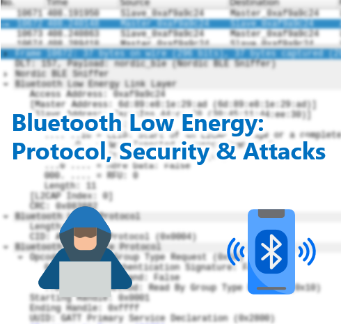

# Bluetooth Low Energy BLE Beertalk

## What is this?

This is a repository containing some data and links for my Beer-Talk about Bluetooth Low Energy (BLE).
See https://www.compass-security.com/de/agenda/detail/beer-talk-in-bern-bluetooth-low-energy-protocol-security-attacks/ for more infos about this event.

## Slides

The slides will be available after the last Beer-Talk (07.05.2020).

## Demo Videos

The demo videos will be available after the last Beer-Talk (07.05.2020).

## Example PCAPs

See [pcaps](./pcaps) directory for example PCAPs.

## Hardware / Software References

- Ubertooth
  - Product Page: http://ubertooth.sourceforge.net/
  - GitHub: https://github.com/greatscottgadgets/ubertooth/
- Bluefruite LE Sniffer
  - Product Page: https://www.adafruit.com/product/2269

## References

### Specifications

* Bluetooth Special Interest Group (SIG): https://www.bluetooth.com/
* Bluetooth Core Specifications Download: https://www.bluetooth.com/specifications/bluetooth-core-specification
* Bluetooth GATT Specifications: https://www.bluetooth.com/specifications/gatt
* Bluetooth GATT Characteristics: https://www.bluetooth.com/specifications/gatt/characteristics
* Bluetooth GATT Overview: https://www.bluetooth.com/specifications/gatt/generic-attributes-overview
* Linux Bluetooth Protocol Stack BlueZ: http://www.bluez.org/

### BLE Introduction

* Introduction to Bluetooth Low Energy: https://learn.adafruit.com/introduction-to-bluetooth-low-energy/introduction
* Reverse Engineering a Bluetooth Low Energy Light Bulb: https://learn.adafruit.com/reverse-engineering-a-bluetooth-low-energy-light-bulb/explore-gatt
* Introducing the Adafruit Bluefruit LE Sniffer: https://learn.adafruit.com/introducing-the-adafruit-bluefruit-le-sniffer/introduction
* Getting Started with Bluetooth Low Energy. O'Reilly. 2014. ISBN: 9781491900550.

### BLE Pairing

* BLE Pairing and Bonding: https://www.kynetics.com/docs/2018/BLE_Pairing_and_bonding/
* Bluetooth Pairing Part 1: Pairing Feature Exchange: https://www.bluetooth.com/blog/bluetooth-pairing-part-1-pairing-feature-exchange/
* Bluetooth Pairing Part 2: Key Generation Methods: https://www.bluetooth.com/blog/bluetooth-pairing-part-2-key-generation-methods
* Bluetooth Pairing Part 3: Low Energy Legacy Pairing Passkey Entry: https://www.bluetooth.com/blog/bluetooth-pairing-passkey-entry
* Bluetooth Pairing Part 4: Bluetooth Low Energy Secure Connections - Numeric Comparison: https://www.bluetooth.com/blog/bluetooth-pairing-part-4/

### BLE Security Research

* Understanding Bluetooth Security: https://duo.com/decipher/understanding-bluetooth-security
* Mike Ryan, Bluetooth LE Security: https://lacklustre.net/bluetooth/
* A Basic Introduction to BLE Security: https://www.digikey.com/eewiki/display/Wireless/A+Basic+Introduction+to+BLE+Security
* Deep Dive into Bluetooth LE Security: https://medium.com/rtone-iot-security/deep-dive-into-bluetooth-le-security-d2301d640bfc

### BLE Security Talks

* Mike Ryan. USENIX WOOT. August 2013. Bluetooth: With Low Energy Comes Low Security
  * Video: https://www.youtube.com/watch?v=Mo-FsEmaqpo
  * Slides: https://lacklustre.net/bluetooth/bluetooth_with_low_energy_comes_low_security-mikeryan-usenix_woot_2013-slides.pdf
  * Whitepaper: https://lacklustre.net/bluetooth/Ryan_Bluetooth_Low_Energy_USENIX_WOOT.pdf
* Tal Melamed. SHA2017. Hack-a-ble
  * Video: https://media.ccc.de/v/SHA2017-230-hack-a-ble
* Mike Ryan. BlackHat 2013. Bluetooth Smart: The Good, the Bad, the Ugly, and the Fix!
  * Video: https://www.youtube.com/watch?v=SoH11fi-FcA
  * Slides: https://lacklustre.net/bluetooth/bluetooth_smart_good_bad_ugly_fix-mikeryan-blackhat_2013.pdf
* Slawomir Jasek. Blue Picking - Hacking Bluetooth Smart Locks. HackInTheBox 2017
  * Slides: https://conference.hitb.org/hitbsecconf2017ams/materials/D2T3%20-%20Slawomir%20Jasek%20-%20Blue%20Picking%20-%20Hacking%20Bluetooth%20Smart%20Locks.pdf
* Damien Cauquil. Weaponizing the BBC Micro Bit. DEF CON 25. 2017
  * Video: https://www.youtube.com/watch?v=I9AqIaMjYcw
  * Slides: https://media.defcon.org/DEF%20CON%2025/DEF%20CON%2025%20presentations/DEF%20CON%2025%20-%20Damien-Cauquil-Weaponizing-the-BBC-MicroBit.pdf
* Damien Cauquil. Bluetooth Low Energy Attacks. Crash Course. 2018
  * Slides: https://nis-summer-school.enisa.europa.eu/2018/cources/IOT/nis-summer-school-damien-cauquil-BLE-workshop.pdf
* Damien Cauquil. You had better secure your BLE devices. DEF CON 26. 2018
  * Video: https://www.youtube.com/watch?v=VHJfd9h6G2s
  * Slides: https://media.defcon.org/DEF%20CON%2026/DEF%20CON%2026%20presentations/DEFCON-26-Damien-Cauquil-Secure-Your-BLE-Devices-Updated.pdf
* Mike Ryan. Bluetooth Hacking: Tools And Techniques. hardwear.io 2019
  * Video: https://www.youtube.com/watch?v=8kXbu2Htteg
  * Slides: https://hardwear.io/usa-2019/presentations/Bluetooth-Hacking-Mike%20Ryan-hardwear-io-usa-2019.pdf
* Taking Bluetooth lockpicking to the next level. Ray and mh. CCCamp19. 2019
  * Video: https://media.ccc.de/v/Camp2019-10241-taking_bluetooth_lockpicking_to_the_next_level
* Damien Cauquil. Defeating BLE 5 PRNG for Fun and Jamming. DEF CON 27. 2019
  * Video: https://www.youtube.com/watch?v=wkIdpK7mAk4
  * Slides: https://media.defcon.org/DEF%20CON%2027/DEF%20CON%2027%20presentations/DEFCON-27-Damien-Cauquil-Defeating-Bluetooth-Low-Energy-5-PRNG-for-fun-and-jamming.PDF
